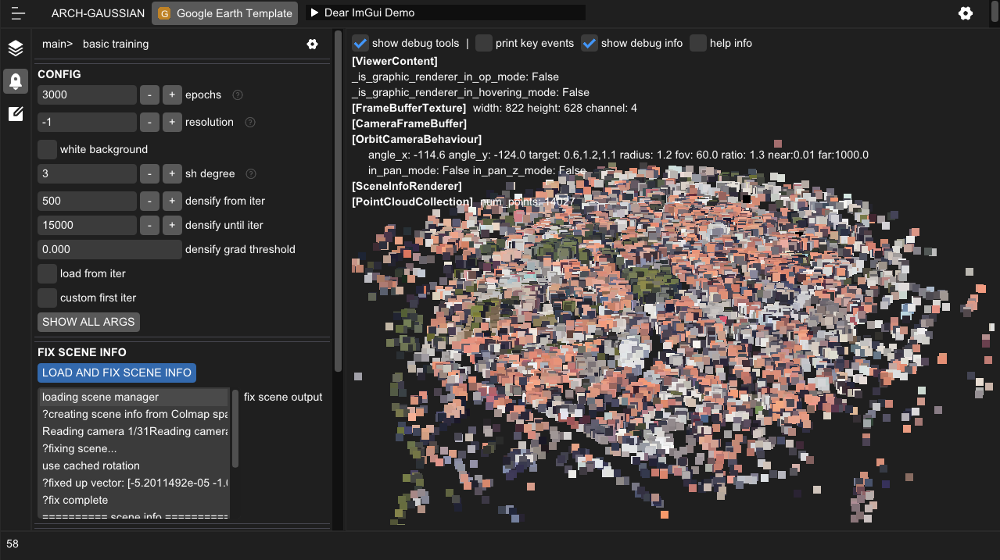

# Arch Gaussian
项目正在早期开发阶段，功能未经过充分测试。
## version 0.2 主要更新内容

新增欢迎页， 图中背景来源https://oneshader.net。（用于测试shader）

渲染 3DGS，较上一版本优化了显示到Imgui窗口中的流程，直接从pytorch tensor中复制数据到Texture缓冲区，避免数据在显卡和CPU之间传输带来的性能损耗。

训练 3DGS，训练过程实时预览结果

3DGS与三角面物体融合显示，自定义三维高斯光栅化渲染c++和cuda代码(见diff-gaussian-rasterization-fork)，增加了深度测试等流程。


支持自定义物体材质与附挂组件。架构类似Unity Component概念。Shader目前使用的最简单的Phong光照模型，支持Shadowmap阴影。
TODO: 支持用户导入模型和贴图，更新到PBR流程。

支持语言切换，语言支持简体中文，目前未完全覆盖。

新增各项debug工具，TextureViewer，查看当前FrameBufferTexture实时状态。TODO:清理长时间未使用资源

其他更新：重构项目结构；popup窗口背景模糊功能；progress集成管理中心（左下角）；运行数据中心（右下角）；退出确认；全屏功能；整合了Renderer， Camera等类；材质系统；主要Shader使用UBO代替每帧写入MVP矩阵。
## Install
```
mkdir ArchGaussianProject // 创建工程文件夹

mkdir projects //创建一个文件夹用于储存后面创建的项目文件

git clone http://git.krangingvalve.xyz/jeremyfff/arch_gaussian.git --recursive //clone代码文件

cd arch_gaussian

//安装依赖项
首先安装cuda版本的pytorch

pip install -r requirements.txt  
pip install src/submodules/diff-gaussian-rasterization-fork
pip install src/submodules/simple-knn  
pip install git+http://git.krangingvalve.xyz/jeremyfff/ImNodeEditor.git  
```

## Version 0.1内容
<div style="text-align:center">
    

</div>

